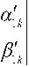
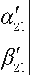
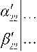
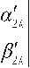
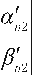
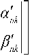
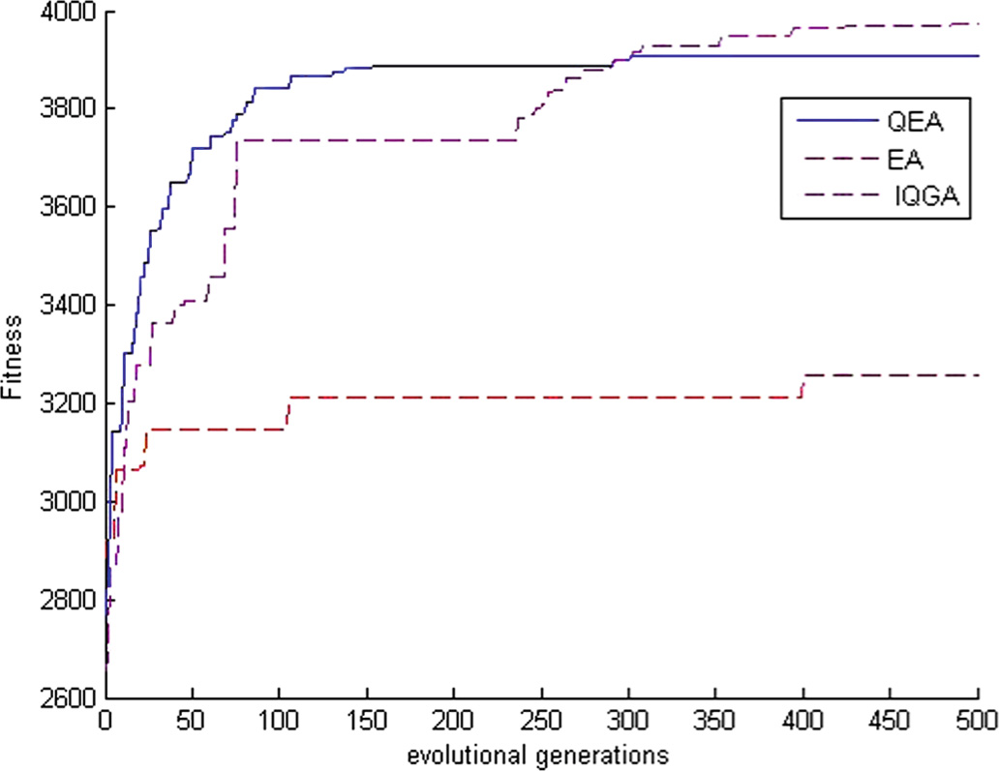

> A New Quantum Evolutionary Algorithm in 0-1 Knapsack
> Problem{width="0.433416447944007in"
> height="0.43383311461067364in"}{width="0.4322911198600175in"
> height="0.4322911198600175in"}
>
> Jialin Li1 and Wei Li2(&)
>
> 1 School of Science and Technology, Gannan Normal University, Ganzhou,
> Jiangxi Province, China lijialin8@hotmail.com
>
> 2 School of Information Engineering, Jiangxi University of Science and
> Technology, Ganzhou, Jiangxi Province, China nhwslw@gmail.com
>
> Abstract. As a common optimization problem in the field of operations
> research. Knapsack problem (KP) is often used in many areas, such as
> business, combinatorial mathematics, computational complexity theory,
> cryptography and applied mathematics. Based on the characteristics of
> 0-1 knapsack problem, this essay proposes an improved quantum
> evolutionary algorithm (IQEA) based on dynamic rotation angle
> catastrophe technology and designs a quantum rotating gate operator
> which adaptively adjusts the values of rotation angle according to the
> fitness value and evolution generations. In the process of evolution,
> the early quantum rotation angle is used to carry out the catastrophic
> operation of some individuals. The individual and the individual after
> the catastrophe are evolved in parallel, and the multipath
> optimization is carried out to improve the paral-lelism of the
> algorithm. This can effectively make the population jump out of the
> current optimal solution, increase the diversity of the population,
> carry out multi direction search, and maintain the stability of the
> population, and ensure that the excellent information in the
> subpopulation will not be lost. The experimental results of the
> typical knapsack problem show that the performance of the algorithm is
> better than the traditional evolutionary algorithm and the traditional
> quantum evolutionary algorithm in solving the knapsack problem.
>
> Keywords: Knapsack problem Quantum evolutionary algorithm Dynamic
> quantum angle Catastrophic technology

1 Introduction

As a common optimization problem in the field of operations research.
Knapsack problem (KP) is often used in many areas, such as business,
combinatorial mathe-matics, computational complexity theory,
cryptography and applied mathematics. The problem of blanking in the
factory, resource allocation in management, capital bud-geting,
investment decision and loading problem can be modeled as knapsack
problem. It is very important to study the solution to this problem in
theory and practice. The study of the knapsack problem can be traced
back to 1897 \[1\]. Because it is difficult to find the global optimal
solution in a limited time, the solution of the knapsack problem is
mainly based on some heuristic algorithms, such as tabu search
algorithm, simulated

© Springer Nature Singapore Pte Ltd. 2019

H. Peng et al. (Eds.): ISICA 2018, CCIS 986, pp. 142--151, 2019.
<https://doi.org/10.1007/978-981-13-6473-0_13>

> A New Quantum Evolutionary Algorithm in 0-1 Knapsack Problem 143

annealing algorithm and so on. There are also some papers using
evolutionary algo-rithms to solve this problem, but when the scale of
the problem is large, the traditional evolutionary algorithms are not
very effective \[2\].

Narayanan and Moore first proposed the quantum genetic algorithm (QGA) In
1996, and successfully solved the TSP problem \[3\], and created the
research direction of the fusion of quantum evolutionary algorithms and
evolutionary computation. The fusion point of quantum computation and
evolutionary algorithm mainly lies in the construction of population
encoding and evolution strategies. Simply speak, the pop-ulation adopts
quantum bit based coding, and the population evolution adopts quantum
bit phase rotation of quantum gates, using quantum Not gate or
catastrophic operation to maintain the diversity of the population. It
is based on some concepts and theories of quantum computing, such as
quantum bit, quantum state superposition, etc., using quantum bit coding
to express chromosomes, and use quantum gate updating to complete
evolutionary search. The quantum genetic algorithm (QGA) proposed by Han
(2000--2006) successfully solves the knapsack problem. The algorithm
uses a quantum rotating gate to make a chromosome change to generate a
new individual, moreover, the strategy of gene transformation can make
the realization of quantum computer possible in the future \[4--6\].
Quantum genetic algorithm is superior to traditional genetic algorithm
in population diversity and computational parallelism, which can
effectively improve the convergence speed and reduce premature
convergence. Scholars at home and abroad have made many attempts to
improve the research of quantum evolutionary algorithms, including the
structure of the algorithm, the way of evolution and the coding method.
For example, Yang of University of Science and Technology of China
proposed a multi universe parallel quantum genetic algorithm \[7\].
Zhang of Southwest Jiao Tong University adopts the quantum bit phase
comparison method to update quantum gates and adjust the strategy of
adaptive search grid \[8\]; Chen of Southwest Jiao Tong University, and
so on, proposes a quantum genetic algorithm for chaos updating the
rotation angle of rotating gate \[9\]; and Tsinghua University's Ling
gives a hybrid quantum genetic algorithm based on two input coding and
based on it. A real coded hybrid quantum genetic algorithm \[10\]. Li
and others proposed a double-chain quantum genetic algorithm based on
real coding and gradient information of objective function to solve
continuous optimization problems \[11\]; other studies in optimization
problems \[12\]. Based on the characteristics of 0-1 knapsack problem,
this essay proposes an improved quantum evolutionary algorithm (IQEA)
based on dynamic rotation angle catastrophe technology and designs a
quantum rotating gate operator which adaptively adjusts the values of
rotation angle according to the fitness value and evolution generations.
In the process of evolution, the early quantum rotation angle is used to
carry out the catastrophic operation of some indi-viduals. The
individual and the individual after the catastrophe are evolved in
parallel, and the multipath optimization is carried out to improve the
parallelism of the algo-rithm. This can effectively make the population
jump out of the current optimal solution, increase the diversity of the
population, carry out multi direction search, and maintain the stability
of the population, and ensure that the excellent information in the
subpopulation will not be lost. The experimental results of the typical
knapsack problem show that the proposed algorithm outperforms
traditional evolutionary algo-rithms and traditional quantum evolution
algorithms in solving the knapsack problem.

144 J. Li and W. Li

2 Knapsack Problem

The 0-1 knapsack problem is the most basic KP problem. This is also an
NP puzzle. It can be described as: Given a set of projects, each project
has its own weight and value. In a limited total weight, study how to
maximize the total value of the project. We assume that the weight and
value of all items are non-negative, and that the maximum weight that a
backpack can bear is W, limiting each item to 0 or 1. The mathematical
model is expressed as follows:

> n
>
> max cixi ð1Þ i¼1
>
> n
>
> s:t: wixi W xi 2 f0;1g;i ¼ 1;2;;n ð2Þ i¼1

In which formula 1 is the target, that is, the value of the items loaded
into the knapsack is the maximum value; formula 2 is a constraint
condition that represents the volume limit of the knapsack, n represents
the total number of items, "i" is the identifier of items, Wi represents
the weight of the item "i", Ci is the value of the item "i", W is the
capacity of the backpack, and the total number of items in the backpack
is m (m \<= n). Xi represents a binary variable, which is used to
measure whether the item I is loaded into the backpack variable. The
value is 0 or 1. When 1 is taken, it indicates that the item I is
selected, for example: N = 10, X = 1100010110 means putting items 1, 2,
6, 8 and 9 in a backpack (m = 5).

3 Quantum Evolution Algorithm

Quantum evolution algorithm (QEA), based on the concepts of quantum bit
and quantum state superposition in quantum computing, uses the
probability amplitude of qubits to represent the coding of chromosomes,
so a qubit chromosome can represent the superposition of multiple
states. Compared with traditional evolutionary algorithms, the algorithm
has better population diversity and higher computational parallelism.
The random observation of simulated quantum collapse makes the
population more abundant. It can improve the convergence speed of the
algorithm, and can make the balance between the exploration and
development of the algorithm, and improve the optimization efficiency of
the algorithm \[13\].

3.1 Qutbit

In QEA, a qubit-based encoding method is used, and (qutbit) is a
two-state quantum system that acts as a physical medium for an
information storage unit, which is a unit

vector defined in Hilbert space. A pair of real number vectors ai can be
used to i

define a quantum bit. The probability that a quantum is in a spin-down
state is jaij2, and the probability that a quantum is in a spin-up state
is jbj2. And meet jaij2 þjbij2 ¼ 1.

> A New Quantum Evolutionary Algorithm in 0-1 Knapsack Problem 145

3.2 Quantum Coding

In quantum evolutionary algorithms, a quantum bit is defined by a pair of
real number

vectors bi using a quantum bit-based encoding scheme, so the Ith quantum
chromosome with k bits can be expressed as:

> i1 bi1

ai2 bi2

> ik

bik

ð3Þ

Among them, 0 states and 1 states are obtained with a certain
probability jaij2 and jbij2 respectively, and satisfy jaj2 þjbj2¼ 1.

Therefore, each multivariate variable (N dimension) can be composed of N
quantum genes. Obviously, if the dimension of the problem is n and the
chromosome population of the T generation is qt, each quantum individual
is composed of N quantum genes, so each quantum individual can be
encoded in the following form of quantum coding:

> {width="0.1872364391951006in"
> height="0.38897419072615924in"}{width="0.14292322834645668in"
> height="0.368999343832021in"}{width="0.1515135608048994in"
> height="0.368999343832021in"}{width="0.14358267716535433in"
> height="0.368999343832021in"}{width="0.2569444444444444in"
> height="0.368999343832021in"}{width="0.15879155730533684in"
> height="0.368999343832021in"}{width="0.14879811898512685in"
> height="0.368999343832021in"}{width="0.1558672353455818in"
> height="0.368999343832021in"}{width="0.20898950131233596in"
> height="0.38897419072615924in"}{width="8.420056867891514e-2in"
> height="0.14409667541557306in"}ð4Þ

Among them, qt is the jth member of the t generation, and k is the qubit
number used for the components of each independent variable.

> Take a 3 bit quantum chromosome as an example to illustrate quantum
> individuals:
>
> {width="0.13001312335958004in"
> height="0.4167771216097988in"}{width="0.12289698162729659in"
> height="0.43701334208223974in"}ð5Þ

This individual contains states: \|000, \|001, \|010, \|011, \|100,
\|101, \|110, and \|111. The probability is 0, 1/9, 0, 8/9, 0, 0, 0, 00
(The proportion of the state \|001〉 is (1)2 (1/3)2 12 = 1/9). From this
example, We can see that 23 = 8 states only need 3 quantum chromosomes
to represent, so the quantum chromosome has the charac-teristics of
diversity. As the quantum chromosomes jaij2 and jbij2 gradually approach
1 or 0, the quantum chromosomes gradually converge to a single state,
the diversity of the population disappears, and the algorithm converges.

4 Application of Improved Quantum Evolutionary Algorithm in 0-1 Knapsack
Problem

Based on the characteristics of 0-1 knapsack problem, this essay
proposes an improved quantum evolutionary algorithm (IQEA) based on
dynamic rotation angle catastrophe technology and designs a quantum
rotating gate operator which adaptively adjusts the values of rotation
angle according to the fitness value and evolution generations. In the
process of evolution, the early quantum rotation angle is used to carry
out the catas-trophic operation of some individuals. The individual and
the individual after the

146 J. Li and W. Li

catastrophe are evolved in parallel, and the multipath optimization is
carried out to improve the parallelism of the algorithm. This can
effectively make the population jump out of the current optimal
solution, increase the diversity of the population, carry out multi
direction search, and maintain the stability of the population, and
ensure that the excellent information in the subpopulation will not be
lost.

4.1 Quantum Coding of the 0-1 Knapsack Problem

In this essay, the 0-1 knapsack problem is quantum coded, and the matrix
represen-tation is used to characterize the 0-1knapsack problem. Each
qubit satisfies jaij2 þjbij2¼ 1 and can be represented by bi . After
observation, the population is a binary coded 0-1 backpack matrix.
Hypothesis that the quantum population size is SizePop and the number of
0-1 knapsack nodes is n, the length of each quantum chromosome is L =
2n. Then, the coding form of the ith individual in the group QðtÞ ¼
fq1;q2;\...;qsizepopg is:

> qt ¼ b1

a2 b2

aj bj

an bn

ð6Þ

In this essay, ~~pffiffi~~ is used as the initial of ai and bi in the
population, which effec-tively guarantees that all states appear with
the same probability.

4.2 IQEA Algorithm Flow

> Step1: Make t = 0, generate the initial population Q(t) by using the
> probability quantum chromosome;
>
> Step2: The initial population is measured and the classical
> chromosomal state P(t) that solves the 0-1 knapsack problem is
> obtained;
>
> Step3: Calculate each state fitness value;
>
> Step4: Record the fitness of the best individual;
>
> Step 5: while (Maximum number of iterations or no update generation) {
>
> t++;
>
> Improved quantum revolving door for updating individual populations; {
>
> When the evolution of the population tends to stagnate;
>
> A group of catastrophic technology is initiated by using a certain
> probability as trigger;
>
> }
>
> The quantum measurement and decoding of the population Q(t) is carried
> out. The state P(t) is obtained;
>
> The fitness of each state is calculated; Record the fitness of the best
> individual. }
>
> A New Quantum Evolutionary Algorithm in 0-1 Knapsack Problem 147

4.3 A New Quantum Rotation Gate Operation

In this IQEA, make the quantum rotation gate URðhÞ ¼ cosh sinh act on
the

quantum chromosome to update its gene bit. The quantum rotating gate is
a 2 2 matrix to represent a bit, and the quantum bit is updated by
changing the direction and size of the quantum rotation angle. The
corresponding operation is \[14\]:

> 0
>
> bi ¼ URðhÞ bi ¼ sinh

sinh ai cosh bi

ð7Þ

> In which h is rotation angle, the quantum chromosome i is transformed
> into

0 i

> i after quantum rotation gate operation. The rotation angle h and the
> rotation
>
> i

direction are selected from the Table 1 quantum rotation angle direction
and size selection table.

> Table 1. Quantum rotation angle direction and size selection table

The Mh value of the quantum rotation angle in the upper table is
generally a fixed value, which is fixed by selecting the rotation angle to
update the gene location of the quantum chromosome through the look-up
table, which can easily lead to the loss of the diversity of the
population, thus making the search easy to fall into the local optimal.
In this essay, a quantum rotating gate operator is designed for the 0-1
knap-sack problem, which adaptively adjusts the value of the rotation
angle according to the fitness value and the evolutionary generations.
The concrete realization is as follows: It is assumed that the values of
ith bit in the individual x and the best individual b after the use of
quantum measurements in a population are represented by xi and bi
respectively. The fitness functions F(xi) and F(bi) are used to represent
individual fitness values, respectively. Combined with Table 1 of this
paper, the value of the dynamic quantum rotation angle can be defined by
the following formula:

148 J. Li and W. Li

> h ¼ SDhðeabsðFðxiÞFðbiÞÞ 1Þ ð8Þ

In which Dh is an initial rotation angle, the rotation direction of the
quantum rotation angle S can be shown in combination with Table 1, and
't' is the current evolutionary generations carried out by the
algorithm. The values of the functions F(xi) and F(bi) change as the
evolutionary generation increases. In the course of evolution, the
quantum rotation angle is dynamically changed according to the rate of
conver-gence. When the algorithm is in the initial stage of evolution
and continuously searches for better solutions, the quantum rotation
angle is larger, so that the algorithm can search in a larger range of
space. As the evolutionary generations of the algorithm is increasing,
the value difference of the optimal solution of the contemporary
solution is slowly changing hours, and the quantum rotation angle is
becoming smaller and smaller, with the convergence of the algorithm
gradually approaching zero.

4.4 Group Catastrophe Technology

In the evolution of quantum evolutionary algorithm, the quantum
chromosome col-lapses to a certain direction under the action of the
quantum rotation gate adjustment strategy. If the algorithm does not
join the mutation operation during the evolution process, when the
equivalent sub bit appears in the convergence state, the measured value
will be fixed to 0 or 1. It is difficult to jump out again, and the
algorithm is easy to have a prematurity problem. When the algorithm does
not change for several gener-ations in the optimal solution, it shows
that the algorithm falls into the local optimal value. At this point,
catastrophic operation can be carried out on the population, and a
greater disturbance will be imposed on the population in the process of
evolution, so that it will be separated from the local optimum. When the
continuous N generations are not renewed, the quantum gates are
triggered by mutation probability to perform quantum dyeing catastrophic
operation.

Because quantum individuals are uncertain in the measurement of
decoding, the decoding process may be out of the local optimum, so the
catastrophic operation uses the rotation angle in the early stage of
evolution to greatly disturb some individuals. Realize the parallel
evolution of contemporary superior individuals and post-catastrophe
individuals, perform multi-path optimization, and improve the
paral-lelism of the algorithm. This can effectively make the population
jump out of the current optimal solution, increase the diversity of the
population, conduct multi-directional search, and also maintain the
stability of the population, ensuring that the excellent information in
the offspring population will not be lost.

4.5 Quantum Measurement

The process of quantum measurement is mainly the process of transforming
a quantum chromosome into a classical body, making them corresponding to
the classical chro-mosomes, and establishing the corresponding
relationship with the solution of the problem. Specific description is:
when measuring (or selecting state), it is based on qubit probability
amplitude \|aij\|2 (or \|bij\|2) to select 0 or 1 of the corresponding
gene

> A New Quantum Evolutionary Algorithm in 0-1 Knapsack Problem 149

position. The specific method of this paper is: use the random function
rand(0,1) to generate a random number r, how its value is greater than
and if it is greater than the value of \|aij\|2 (or \|bij\|2), then
generate 0 or 1, the measurement result is 1; otherwise, it takes 0 (or
vice versa).

5 Results Analysis

In this essay selects the 0-1 knapsack optimization problem with 100
items to carry out experiment. For simplicity, it is recorded as KP100.
Each item is encoded in a quantum bit, so the quantum chromosome length
is the number of items. In this paper, MATLAB is used to implement the
algorithm. The population sizes are set to 10 and 20 respectively. The
maximum evolution generations is 500. The algorithm is solved by
traditional EA, QEA and IQEA respectively. Each case runs continuously
for 10 times. Then the data of 10 highest fitness values searched 10
times are analyzed statistically. When optimizing the knapsack problem,
m denotes the population size, f(x) denotes the maximum fitness value
that is searched for every 10 times. "Best", "Worst" and "Average"
represent the maximum fitness values, the minimum fitness values and the
average fitness values for the 10 best results found in 10 consecutive
experiments respectively. In this essay, all termination conditions for
knapsack opti-mization are the largest evolution generations is 500. In
this essay, the most important index to judge the effect of optimization
is "mean", that is, the average fitness of 10 searches.

According to the data in Table 2, the quantum evolution algorithm based
on the dynamic rotation angle catastrophe technique has obvious
advantages in obtaining the accuracy of the optimal solution. For
different initial population sizes, the search ability is different.
When the population size is small, the three algorithms do not find the
optimal solution in 500 generations. When the population size reaches a
certain number, the result of the algorithm is better. Enhanced, IQEA
can better find the optimal solution, and the average result is also
close to the optimal result, but continue to increase the population
size, and does not greatly improve the accuracy of the results.

> Table 2. KP100's experimental data table

Figure 1 is a graph of three algorithms for KP100 with a population of
20. From the convergence graph of Fig. 1, it can be seen that the
improved quantum evolution algorithm is more difficult to fall into local
optimum and the convergence speed is faster.

150 J. Li and W. Li{width="2.952749343832021in"
height="2.2779582239720035in"}

> Fig. 1. Comparison of KP100 experiments

6 Conclusion

Based on the characteristics of 0-1 knapsack problem, this essay
proposes an improved quantum evolutionary algorithm (IQEA) based on
dynamic rotation angle catastrophe technology and designs a quantum
rotating gate operator which adaptively adjusts the values of rotation
angle according to the fitness value and evolution generations. In the
process of evolution, the early quantum rotation angle is used to carry
out the catas-trophic operation of some individuals. The individual and
the individual after the catastrophe are evolved in parallel, and the
multipath optimization is carried out to improve the parallelism of the
algorithm. This can effectively make the population jump out of the
current optimal solution, increase the diversity of the population,
carry out multi direction search, and maintain the stability of the
population, and ensure that the excellent information in the
subpopulation will not be lost. The experimental results show that the
improved quantum evolution algorithm is better than the evolutionary
algorithm and the traditional quantum evolution algorithm in solving the
0-1 knapsack problem.

References

> 1\. Mathews, G.B.: On the partition of numbers. Lond. Math. Soc. 28,
> 486--490 (1897)
>
> 2\. Wang, X.Z., He, Y.C.: Evolutionary algorithms for knapsack
> problems. Ruan Jian Xue Bao/J. Softw. 28(1), 1--16 (2017). (in
> Chinese)
>
> 3\. Narayanan, A., Moore, M.: Quantum inspired genetic algorithm. In:
> IEEE International Conference on Evolutionary Computation, Iscataway,
> pp. 61--66 (1996)
>
> 4\. Han, K.-H., Kim, J.-H.: Genetic quantum algorithm and its
> application to optimization problem. In: Proceedings of the 2000 IEEE
> Congress on Evolutionary. IEEE Press, USA, pp. 1354--1360 (2000)
>
> A New Quantum Evolutionary Algorithm in 0-1 Knapsack Problem 151
>
> 5\. Han, K.-H., Park, K.-H., Lee, C.-H.: Parallel quantum inspired
> genetic combinatorial optimization problem. In: Proceedings of the
> 2001 IEEE Congress on Combinatorial Computation algorithm for
> Evolutionary Computation. IEEE Press, USA, pp. 1422--1429 (2001)
>
> 6\. Han, K.-H., Kim, J.-H.: On the analysis of the quantum-inspired
> evolutionary algorithm with a single individual. In: Proceedings of
> the 2006 IEEE Congress on Evolutionary Computation. IEEE Press, USA,
> pp. 2622--2629 (2006)
>
> 7\. Yang, J.A., et al.: Multi-cosmic parallel quantum genetic
> algorithm. Chin. J. Electron. 32(6), 923--928 (2004)
>
> 8\. Zhang, G.X., et al.: A novel quantum genetic algorithm and its
> application. ACTA Electr. Sin. 32(3), 476--479 (2004)
>
> 9\. Chen, H., et al.: Chaos updating rotated gates quantum-inspired
> genetic algorithm. In: Proceedings of the International Conference on
> Communications, Circuits and systems, vol. 2, pp. 1108--1112 (2004)

10\. Ling, W., et al.: Hybrid numerical optimization genetic algorithm
based on quantum computing for and parameter estimation. Appl. Math.
Comput. 171, 1141--1156 (2005)

11\. Li, S., et al.: Quantum genetic algorithm based on real coding and
gradient of objective function. J. Harbin Univ. Technol. 38(8),
1216--1218, 1223 (2006)

12\. Liang, X.: Research on the application of evolutionary algorithms
and quantum computing in optimization problems. China University of
Science and Technology (2012).
[https://doi.](http://dx.doi.org/10.7666/d.y2125828)
[org/10.7666/d.y2125828](http://dx.doi.org/10.7666/d.y2125828)

13\. Bhatia, A.K., Basu, S.K.: Tackling 0/1 knapsack problem with gene
induction. Soft. Comput. 8(1), 1--9 (2003)

14\. Li, J.L., et al.: A new quantum rotation angle of quantum-inspired
evolutionary algorithm for TSP. Int. J. High Perform. Syst. Arch. 7(4),
223--230 (2017)
